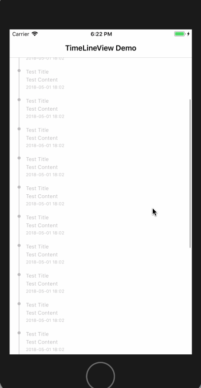

# ZMTimeLineView
A simple Time Line View library by Swift

# Screenshot



# Setup

#### Install with [CocoaPods](http://cocoapods.org/)

```ruby
pod 'ZMTimeLineView', '~> 0.1.0'
```

#### [Example](Example/Example/ViewController.swift)

# Configuration

* `padding`
* `titleFont`
* `contentFont`
* `dateTimeFont`
* `textColor`
* `highlightTextColor`
* `lineWidth`
* `circleRadius`
* `highlightCircleBorderWidth`
* `highlightCircleBorderColor`

# License

[MIT](LICENSE)